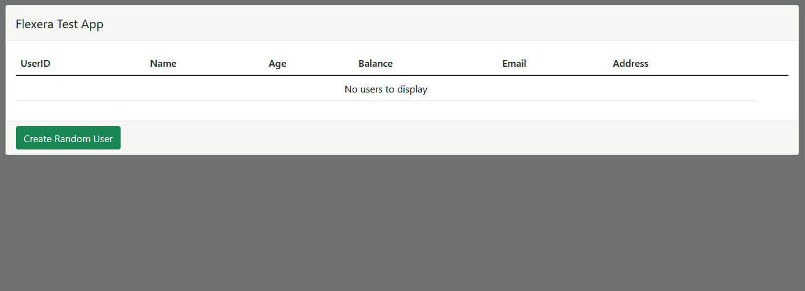

## ⭐ Flexera Test App

### What is this?

A monorepo containing the backend and frontend of a very basic app that lets you create and delete users.

### How is it made?

* The backend is an ExpressJS server which provides three endpoints for getting, creating and deleting users. Users are written to a very simple database provided by [LowDB](https://github.com/typicode/lowdb).

* The frontend is a simple React app which demonstrates the getting, creating and deleting of users.

### How do I run it?

If you guys were running Windows I would have written a script to automate all of this, but in place of that:

* Clone the repo with `git clone https://github.com/marknorrapscm/flexera-test-app.git`
* Run `npm install` in both the `backend` and `frontend` directories
* Run `npm run start` in both the backend and frontend directories

Alternatively, for the frontend you can just spin up an HTTP server in the `build` directory. I have included this intentionally so you can avoid installing all the React dev stuff if you wish.

### What does it do?

The backend provides three endpoints for creating, deleting and getting users. The `get` function allows for sorting by `email` and `name`, but I haven't implemented this in the frontend. The frontend is just an accessory which demos the backend:

  
Show / hide GIF

  ---

  
  ---

---

### Things to note:

I ran out of time whilst making this so here are my excuses:

* I haven't used ExpressJS as standalone in ages so I've probably done / not done a bunch of things that a proper ExpressJS dev would do. I would have used NextJS, which has Express bundled, but that felt like cheating
* Likewise, I used LowDB because it's quick and saved me having to setup DynamoDB / MongoDB
* I would also have added unit tests and probably have used Typescript for better OOP
* The spec asked for the endpoints to be under `http://app/people` - I couldn't do this easily with Express (in Windows at least) so it's running under `http://localhost:8080`. I've configured CORS to allow everything so the frontend should work whatever it runs under